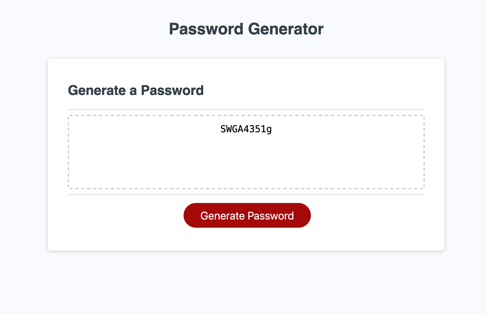

# Password Generator #
## Module 3 Challenge ##

A password generator made with Javascript, HTML and CSS. The user is prompted about their desired password criteria. The password must have between 8 and 128 characters. When the user clicks the button, the password appears in the text box.

## Repository ##

https://github.com/aberger3647/password-generator

## Deployed App ##

https://aberger3647.github.io/password-generator/

